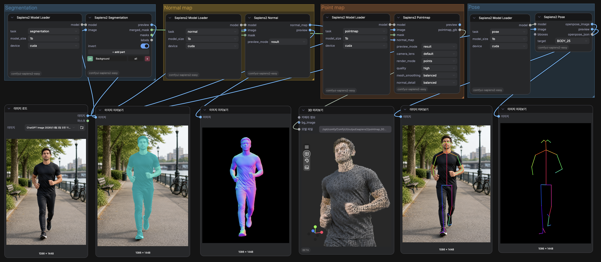
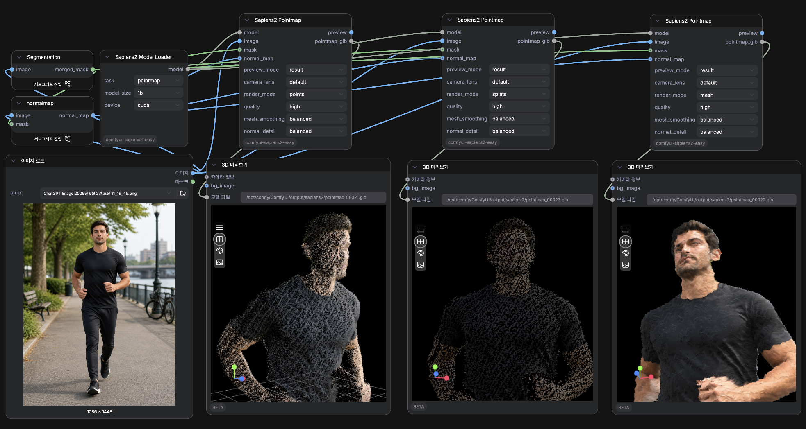
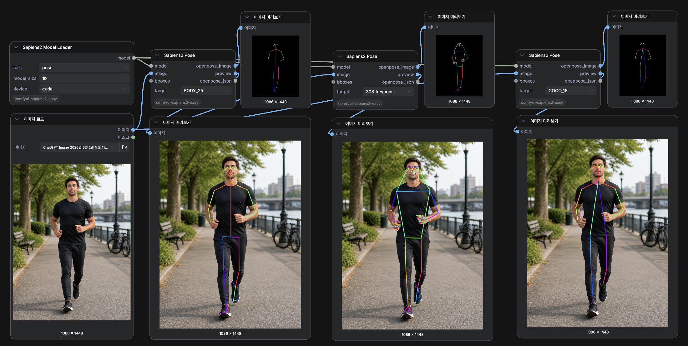

# ComfyUI-Sapiens2-Easy

[한국어](README.ko.md) | [English](README.md)

이미지 한 장에서 mask, normal, 3D pointmap, pose까지 ComfyUI 안에서 바로 연결합니다.

[](https://github.com/Bogyie/ComfyUI-Sapiens2-Easy/stargazers)
[](LICENSE.md)
[](https://registry.comfy.org/ko/nodes/comfyui-sapiens2-easy)
[](https://github.com/facebookresearch/sapiens2)

<p align="center">
  
</p>

세그멘테이션, 노멀 추정, pointmap/GLB 내보내기, pose 출력을 하나의 ComfyUI 그래프로 구성할 수 있습니다.

<table>
  <tr>
    <td width="50%"></td>
    <td width="50%"></td>
  </tr>
  <tr>
    <td align="center"><strong>Pointmap을 points, splats, textured mesh GLB로 내보낼 수 있습니다.</strong></td>
    <td align="center"><strong>BODY_25, COCO_18, 308-keypoint, hand, face용 pose 출력을 생성합니다.</strong></td>
  </tr>
</table>

**ComfyUI-Sapiens2-Easy**는 Meta Sapiens2를 ComfyUI스럽게 쓸 수 있도록 작은 노드 세트로 정리합니다. 작업, 모델 크기, 디바이스만 고르면 mask, normal map, 3D preview, GLB file, pose JSON까지 자연스럽게 연결할 수 있습니다.

## 왜 쓰나요

- **작업별 공통 로더**: segmentation, normal, pointmap, pose가 같은 모델 로딩 흐름을 사용합니다.
- **자동 다운로드와 재사용**: 공식 Hugging Face 가중치를 `ComfyUI/models/sapiens2/`에 저장하고 재사용합니다.
- **마스크 중심 사람 워크플로**: 사람 영역을 분리한 뒤 normal 또는 pointmap으로 바로 연결합니다.
- **단일 이미지 3D 내보내기**: pointmap을 points, splats, textured `.glb` mesh로 내보낼 수 있습니다.
- **후속 도구 친화적인 pose 출력**: `BODY_25`, `COCO_18`, `308-keypoint`, hand, face target을 생성합니다.
- **ComfyUI 환경 보호 설치**: 설치 과정에서 PyTorch/CUDA 런타임 스택이 조용히 바뀌지 않도록 보호합니다.

## 지원 기능

| 작업 | 출력 |
| --- | --- |
| **Segmentation** | 신체 부위 마스크, 병합 마스크, 선택 영역 프리뷰, raw label |
| **Normal** | Sapiens2 surface normal map |
| **Pointmap** | Depth 스타일 프리뷰와 points, splats, mesh `.glb` 내보내기 |
| **Pose** | Sapiens2 308-keypoint pose와 OpenPose 스타일 image/JSON 출력 |

지원 모델 크기: `0.4b`, `0.8b`, `1b`, `5b`

## 시작하기

| 링크 | 내용 |
| --- | --- |
| [설치와 사용 가이드](docs/GUIDE.ko.md) | 설치, 모델 동작, 노드 세부 정보, 문제 해결을 담은 한국어 가이드 |
| [English guide](docs/GUIDE.md) | Full usage guide in English |
| [ComfyUI Registry](https://registry.comfy.org/ko/nodes/comfyui-sapiens2-easy) | 이 노드팩의 Registry 페이지 |

추천 첫 그래프:

```text
Image Load
  -> Sapiens2 Segmentation
  -> Sapiens2 Normal
  -> Sapiens2 Pointmap
  -> ComfyUI 3D Preview
```

처음 써보기 좋은 설정: `model_size = 1b`, `device = cuda`, `quality = high`, `mesh_smoothing = balanced`.

## 노드 구성

| 기본 노드 | 고급 노드 |
| --- | --- |
| Sapiens2 Model Loader | Sapiens2 Segmentation Advanced |
| Sapiens2 Manual Model Loader | Sapiens2 Normal Advanced |
| Sapiens2 Segmentation | Sapiens2 Pointmap Mesh Advanced |
| Sapiens2 Normal | Sapiens2 Pose Advanced |
| Sapiens2 Pointmap |  |
| Sapiens2 Pose |  |

## 범위

이 저장소는 Meta Sapiens2를 ComfyUI에서 쓰기 위한 어댑터입니다. 공식 Sapiens2 모델을 학습, 수정, 재배포하지 않습니다. 모델 가중치와 upstream 자료는 Meta의 Sapiens2 라이선스를 따릅니다.

## 크레딧

- Meta Sapiens2: https://github.com/facebookresearch/sapiens2
- ComfyUI: https://github.com/comfyanonymous/ComfyUI

## 라이선스

이 저장소의 원본 어댑터 코드와 문서는 MIT License로 제공됩니다. 자세한 내용은 [LICENSE.md](LICENSE.md)를 확인하세요.

Meta의 Sapiens2 모델, weights, upstream source code, algorithms, documentation은 Meta Sapiens2 License를 따릅니다: https://github.com/facebookresearch/sapiens2/blob/main/LICENSE.md
